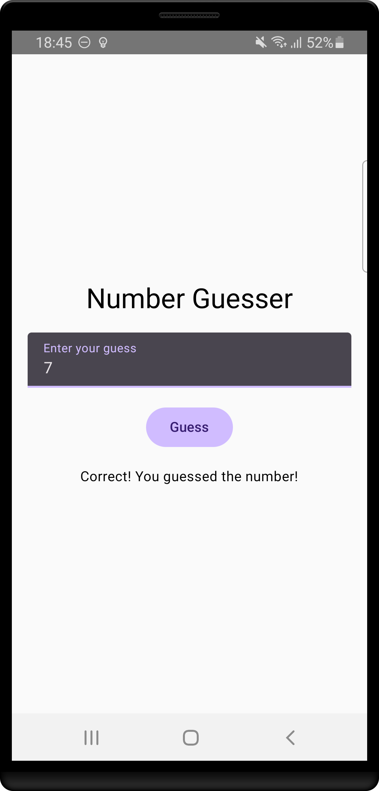

# Number Guesser App

This is a simple game where users try to guess a randomly generated number within a specified range. The game provides feedback on whether the guessed number is too high, too low, or correct.

## Screenshot

<figure>
  
  <figcaption>Screenshot of Number Guesser App</figcaption>
</figure>

## How to Use

1. **Download the App**: Download the app from the [Releases tab](https://github.com/SoaresPT/NumberGuesserApp/releases)
2. **Start the App**: Launch the app on your device.
3. **Make a Guess**: Enter a number within the specified range in the text field.
4. **Get Feedback**: Click the "Guess" button and see the feedback indicating if your guess is too high, too low, or correct.
5. **Keep Guessing**: Continue to guess until you find the correct number.
